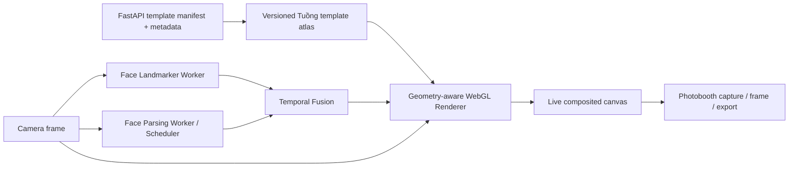

# AI Virtual Try-On & Photobooth — Implementation Plan

> **Status:** Technical pilot implemented; external launch gates open  
> **Last updated:** 2026-08-15  
> **Scope:** Real-time, single-face Tuồng mask try-on in the existing React/Vite application, followed by a privacy-first Photobooth flow.

Implementation evidence and the explicit list of unclosed gates are recorded in [try-on-technical-validation-report.md](./try-on-technical-validation-report.md). Checked tasks below mean repository implementation/validation is complete; unchecked tasks require missing engineering work, licensed assets, cultural review, participant evaluation or the named physical-device matrix.

## 1. Product decision

Build the first release as a **browser-first hybrid computer-vision and graphics system**:

1. **Face Landmark:** MediaPipe Face Landmarker estimates the dense 3D face mesh, head transform and expression blendshapes.
2. **Face Parsing:** a lightweight semantic segmentation model separates skin, eyes, eyebrows, nose, lips, mouth, hair and relevant occluders.
3. **Geometry-aware Mask Warping:** a canonical, layered Tuồng texture is deformed over the live face mesh; it is not placed as one rigid PNG.
4. **Pose / Expression Handling:** region-specific geometry follows head pose, blinking, eyebrow motion, smiling and mouth opening while protecting live eyes and the mouth cavity.
5. **Temporal Stability:** landmark, pose and parsing results are fused over time; stale or low-confidence results fade instead of jumping.
6. **Photobooth:** the user captures the composited result, selects a cultural frame, then downloads or shares it.

This is a stronger and more controllable AI contribution than `detect face -> place PNG`. It also avoids making an end-to-end generative model responsible for the user's identity or for culturally sensitive Tuồng patterns.

### Recommended v1 boundary

- One face at a time.
- 6 pilot templates; 8–12 culturally reviewed templates at public launch.
- Live camera and still-photo capture; no recorded video export in v1.
- On-device inference by default; camera frames are not sent to FastAPI.
- No arbitrary user-uploaded makeup/mask reference in v1.
- Do not promise all 117 gallery illustrations as try-on assets. The existing illustrations have baked-in facial features and need to be re-authored into canonical layers before they can deform naturally.

## 2. Research findings and their effect on the design

### MediaPipe Face Landmarker

The Web task returns **478 3D landmarks**, **52 expression blendshapes** and an optional facial transformation matrix. These outputs cover rigid pose and non-rigid facial motion well enough for an initial geometry-driven renderer. MediaPipe also applies smoothing only when `numFaces = 1`, which supports the single-face v1 scope. Its `detect()` and `detectForVideo()` calls are synchronous and block the UI thread, so inference must run in a Web Worker. The Web solution is still marked Preview; pin the exact package/model versions and keep a regression fixture set. See the [official Web guide](https://developers.google.com/edge/mediapipe/solutions/vision/face_landmarker/web_js).

### Face parsing datasets

- [CelebAMask-HQ](https://github.com/switchablenorms/CelebAMask-HQ) has 30,000 high-resolution faces with 19 semantic classes, including skin, eyes, brows, nose, lips, hair and accessories. Its dataset and reference software are restricted to non-commercial research/education.
- [LaPa](https://github.com/jd-opensource/lapa-dataset) contains more than 22,000 faces with 11 parsing classes and 106 landmarks, including pose, expression and occlusion variation. The dataset terms are non-commercial even though the repository code has a separate Apache-2.0 license.
- [BeautyREC / BeautyFace](https://li-chongyi.github.io/BeautyREC_files/) contributes 3,000 512×512 faces with parsing annotations and a small 1M-parameter component-specific transfer model. The official [code license](https://raw.githubusercontent.com/learningyan/BeautyREC/main/License) permits non-commercial use and requires contacting the authors for commercial use.

**Decision:** these sources are useful for research, pretraining experiments and defining the label taxonomy, but they are not automatically safe production dependencies. Before shipping any model or weights derived from them, complete a written dataset/weights license review. A commercial release should use explicitly licensed weights/data or a model fine-tuned on a consented project-owned dataset.

### WACV 2026 real-time makeup transfer

[Towards High-Fidelity, Identity-Preserving Real-Time Makeup Transfer](https://arxiv.org/abs/2509.02445) provides the most useful architectural idea: decouple style extraction into canonical RGBA masks from fast graphics-based application. It generates pseudo-ground truth with procedural templates and uses landmark alignment, face parsing, thin-plate-spline warping and alpha-aware losses.

The paper also states that its approach assumes non-opaque, natural makeup and is sensitive to 2D landmark/parsing errors under extreme pose and self-occlusion. Tuồng paint is often opaque, graphic and closer to special-effect makeup. Therefore:

- Reuse the **decoupled canonical-template + real-time renderer** principle.
- Reuse procedural/synthetic augmentation concepts for training and evaluation.
- Do not treat the paper's makeup-extraction model as a drop-in Tuồng solution.
- Prefer dense 3D face geometry plus curated Tuồng layers in v1.
- Explore learned Tuồng style extraction only after the renderer and template authoring format are stable.

## 3. Target user experience

### Entry points

- A dedicated **AI Virtual Try-On** section after the gallery.
- A `TRY THIS MASK` action from eligible mask cards/detail views.
- Masks without an approved try-on template remain view-only; never silently fall back to stretching the gallery PNG.

### State flow

`intro -> camera permission -> model loading -> face calibration -> live try-on -> countdown/capture -> frame selection -> download/share`

Required alternate states:

- Permission denied: explain how to re-enable camera and offer still-photo input later.
- Unsupported/slow device: lower camera resolution and parsing cadence; if quality still fails, offer a still-photo mode.
- No face / multiple faces: show an unobtrusive alignment guide; do not choose a face unpredictably.
- Face temporarily lost: hold briefly, then fade the mask out; never leave a frozen mask on the screen.
- Extreme pose or heavy occlusion: show `MOVE FACE INTO FRAME` and reduce/fade the affected region.

### Live controls

- Previous/next mask and compact mask carousel.
- Compare: press-and-hold to reveal the original camera image.
- Effect intensity only where culturally appropriate; it must not arbitrarily recolor character-defining patterns.
- Camera flip on supported mobile devices.
- Privacy status: `PROCESSING ON THIS DEVICE`.
- Clear stop/close action that immediately stops every `MediaStreamTrack`.

### Photobooth

1. Three-second countdown with reduced-motion alternative.
2. Capture the **same composited WebGL canvas** used for live preview so framing and saved output match.
3. Optionally take a short three-image burst and let the user select the best shot.
4. Select a decorative Tuồng frame (portrait, square social card, or photo strip).
5. Add mask/character name and a short attribution/lore line from approved project data.
6. Export PNG/JPEG locally.
7. Use the Web Share API when supported; otherwise download and offer copyable share text.

No image is uploaded merely because the user presses Capture. Server-hosted sharing, if ever added, requires a separate opt-in, retention period and delete flow.

## 4. Proposed technical architecture



### 4.1 Browser-first inference

- Run Face Landmarker in `VIDEO` mode inside a dedicated worker.
- Run face parsing in a second worker or a scheduler that cannot queue more than one unresolved frame.
- Prefer an optimized/quantized face-parsing model exported to ONNX/ORT format.
- Use ONNX Runtime Web. Benchmark provider order per artifact: the selected QDQ INT8 parser defaults to WASM because measured WebGPU latency is much worse; WebGPU remains an explicit diagnostic path. Benchmark WebGL only as a legacy fallback because it is in maintenance mode.
- Do not assume WebGPU on Safari/iOS. The [official ONNX Runtime Web support matrix](https://onnxruntime.ai/docs/get-started/with-javascript/web.html#supported-versions) currently requires a WASM/WebGL fallback there.
- Keep all model inputs at a fixed, benchmarked resolution. Experiments started at 512/256; the technical pilot uses 128×128 parsing crops to meet browser cadence, with boundary-quality release gates left open.
- Load models only when the user opens Try-On, then cache immutable model assets with content hashes.

On-device inference reduces latency, server cost and privacy risk; ONNX Runtime documents these same browser-inference advantages in its [Web deployment guide](https://onnxruntime.ai/docs/tutorials/web/).

### 4.2 Frame scheduling

Run the three loops at different rates:

| Loop | Target cadence | Responsibility |
|---|---:|---|
| Renderer | Display refresh, target 30 FPS | Draw video, warped texture, clipping and UI-safe overlays |
| Face landmarks | 24–30 Hz where possible | Dense mesh, pose, face confidence and blendshapes |
| Face parsing | Adaptive 8–15 Hz | Semantic boundaries and occlusion masks |

Rules:

- Timestamp every frame and result with `performance.now()`.
- Drop late results instead of applying them out of order.
- Allow only one pending parse inference; reuse/reproject the latest valid parsing mask between updates.
- Reduce parsing cadence before reducing renderer cadence.
- Pause inference when the page is hidden, and dispose models/workers/camera tracks on exit.

### 4.3 Geometry-aware warping

Each Tuồng asset is authored in one canonical face coordinate system and mapped to a stable subset of the MediaPipe topology.

Recommended v1 renderer:

- Use a triangulated WebGL mesh with canonical UV coordinates.
- Use the facial transformation matrix for rigid head translation/rotation/scale.
- Use the current dense landmarks for local non-rigid deformation.
- Use piecewise-affine triangle interpolation on the GPU for live rendering.
- Reserve thin-plate spline for offline authoring/alignment experiments or for a later GPU implementation; do not perform a full CPU TPS solve every frame.
- Preserve texture detail in UV space so strokes do not change thickness unpredictably.

Split a template into semantic layers rather than one face-sized bitmap:

| Layer | Geometry anchors | Expression / clipping policy |
|---|---|---|
| Base face color | contour, forehead, cheeks, jaw | Follow rigid pose and broad face shape; clip against hair/eyes/mouth |
| Brows and eye motifs | brow, eyelid, temple landmarks | Follow brow/blink motion conservatively; keep sclera/iris visible |
| Nose motif | bridge, tip, wings | Follow local mesh; limit stretch under yaw |
| Cheek motifs | nose, cheekbone, jaw anchors | Fade/cull self-occluded side under large yaw |
| Mouth / moustache / chin | philtrum, lip contours, chin, jaw | Protect mouth cavity and teeth; follow smile/open-mouth deformation |
| Hairline / forehead ornament | forehead and temple anchors | Clip against parsed hair and frame boundary |

### 4.4 Face parsing and occlusion

Parsing is not the primary alignment mechanism; it acts as a **semantic boundary and occlusion controller** around the geometry-driven warp.

Minimum label mapping:

- face/skin
- left/right eye and brow
- nose
- upper/lower lip and inner mouth
- hair
- background
- glasses/other occluder when supported by the selected model

Post-processing:

- Crop from the landmark face box with 15–20% context.
- Resize to fixed model input; restore output to camera coordinates.
- Apply small morphological close/open operations only to remove isolated holes/noise.
- Feather boundaries in screen space; do not blur the internal Tuồng line art.
- Fuse semantic masks with hard landmark polygons around irises, eyelids, lips and mouth cavity.
- Reproject the previous parsing mask through the latest mesh between parser updates.

If glasses or hands are not recognized reliably, v1 should report a documented limitation instead of hallucinating an occlusion boundary.

### 4.5 Pose and expression handling

- Derive yaw/pitch/roll from the facial transformation matrix.
- Start the supported quality envelope at approximately yaw ±35° and pitch ±25°; tune these values from the evaluation set.
- Back-face cull or alpha-fade triangles on the far cheek at larger yaw.
- Clamp local triangle area/edge-ratio changes to prevent torn or inverted patterns.
- Use blendshapes as state signals, while landmark geometry remains the source of deformation:
  - blink: protect the real eyelid/eye opening;
  - jaw open: separate upper/lower mouth-adjacent layers;
  - smile/frown: deform moustache/chin motifs with guarded limits;
  - brow raise: allow brow motifs to move without pulling forehead artwork excessively.
- At extreme pose or lost confidence, fade the effect and guide the user back to the supported range.

### 4.6 Temporal stability

Use multiple complementary controls:

1. MediaPipe's single-face tracking/smoothing.
2. A velocity-adaptive One Euro filter for selected landmarks and a separate low-pass filter for pose.
3. Region-specific smoothing: face contour and forehead can be smoother; eyelids and lips must respond faster.
4. Temporal EMA for parsing probabilities, after reprojection into the current frame.
5. Confidence state machine:
   - `TRACKED`: render normally;
   - `UNCERTAIN`: keep the last valid transform for at most ~100 ms while reducing alpha;
   - `LOST`: fade out over ~150 ms and wait for stable re-acquisition.
6. Reset filters after camera flip, resolution change, long frame gap or new face acquisition.

Optical flow is a Phase 5 experiment only if mesh reprojection cannot meet the stability metric; adding it prematurely increases compute and failure modes.

## 5. Tuồng template system

### 5.1 Template deliverable

Every try-on mask must be a reviewed package, separate from its gallery illustration:

- Canonical 1024×1024 transparent texture atlas, optimized to WebP/PNG variants.
- Individual semantic layer masks.
- UV coordinates and landmark/mesh bindings.
- Layer order, blend mode and default intensity.
- Protected live regions: iris/sclera, nostril, lip gap, teeth and facial hair policy.
- Supported pose/expression limits.
- Character/mask link to the existing `mask_id`.
- Source, asset license, author, version and cultural reviewer approval.
- Thumbnail and Photobooth attribution/lore text.

Suggested manifest shape:

```json
{
  "id": "tuong_tryon_ac_ba_v1",
  "mask_id": "ac_ba",
  "version": 1,
  "topology_version": "mediapipe_face_478_v1",
  "atlas_url": "/try-on/templates/ac_ba/v1/atlas.webp",
  "layers": [
    {
      "id": "eye_motifs",
      "region": "eyes_brows",
      "blend_mode": "normal",
      "occlusion_policy": "preserve_live_eyes"
    }
  ],
  "pose_limits": { "yaw": 35, "pitch": 25 },
  "cultural_review": { "status": "approved", "version": 1 },
  "license": { "asset_owner": "project", "usage": "web_try_on" }
}
```

### 5.2 Authoring workflow

1. Select six visually distinct characters for the pilot, with a cultural advisor.
2. Redraw/clean each mask on the canonical face; remove baked-in eyeballs and mouth interiors.
3. Separate regions into the layer taxonomy above.
4. Bind and preview the layer on canonical neutral, smile, blink, jaw-open and ±pose fixtures.
5. Test on at least five different face shapes before cultural review.
6. Approve visual accuracy, character identity and attribution.
7. Export, optimize, validate the manifest and version the package immutably.

Do not use face parsing or makeup datasets as sources of Tuồng iconography. The project-owned template set is the domain-specific cultural dataset.

## 6. Data and ML plan

### 6.1 R&D dataset use

- Benchmark at least two lightweight parsing baselines, including a BiSeNet-like model.
- Record source, data terms, code license, weight license, preprocessing and model hash in a model card.
- Use CelebAMask-HQ, LaPa and BeautyFace only inside their permitted R&D scope until legal review is complete.
- Do not assume an MIT/Apache repository license overrides restrictions on the training images or downloaded weights.

### 6.2 Project-owned evaluation set

Create a consented, access-controlled evaluation set before fine-tuning:

- 30–50 participants, prioritizing Vietnamese users and diverse face shapes, ages, skin tones and genders.
- Short clips under neutral, warm/cool, dim and backlit conditions.
- Frontal, yaw, pitch, smile, frown, blink and mouth-open motions.
- Explicit glasses, facial hair, partial occlusion and low-end camera cases.
- No identity labels are needed for the product; assign random subject IDs and store consent separately.
- Annotate representative frames for key semantic boundaries and fit-quality review.
- Define retention, access, deletion and no-secondary-use rules before collection.

Use synthetic transforms for blur, compression, lighting, camera noise and partial occlusion, but never let synthetic-only results replace evaluation on consented real clips.

### 6.3 Fine-tuning gate

Fine-tune a parser only if the chosen licensed baseline misses the launch boundary metrics on the project evaluation set. A fine-tuned model must include:

- reproducible training config and data version;
- validation split by person, not by frame;
- ONNX export and numeric-parity test against the training framework;
- FP32 and quantized latency/quality comparison;
- model card with intended use, limitations and group-wise metrics;
- signed license/data approval before deployment.

No makeup-transfer GAN/diffusion model is required for v1.

## 7. Integration with the current repository

### Frontend

Proposed structure:

```text
frontend/src/
├── api/
│   └── tryOnService.js
└── features/try-on/
    ├── components/
    │   ├── TryOnExperience.jsx
    │   ├── TryOnControls.jsx
    │   ├── CameraPermission.jsx
    │   ├── AlignmentGuide.jsx
    │   └── Photobooth.jsx
    ├── engine/
    │   ├── TryOnEngine.js
    │   ├── FrameScheduler.js
    │   ├── workers/
    │   │   ├── faceLandmarker.worker.js
    │   │   └── faceParser.worker.js
    │   ├── tracking/
    │   │   └── TemporalStabilizer.js
    │   └── rendering/
    │       ├── TuongRenderer.js
    │       ├── TemplateLoader.js
    │       └── OcclusionComposer.js
    ├── photobooth/
    │   ├── CaptureComposer.js
    │   └── ShareExporter.js
    └── state/
        └── tryOnMachine.js
```

Additional assets:

```text
frontend/public/
├── models/try-on/<content-hashed-model-files>
└── try-on/templates/<template-id>/<version>/...
```

Implementation rules:

- React components own UI state; `TryOnEngine` owns camera/inference/render lifecycle.
- Components do not call `fetch()` directly; template metadata goes through `src/api/tryOnService.js` per the existing frontend rule.
- Lazy-load the entire try-on feature and its models so the gallery bundle does not regress.
- Keep the display/capture pipeline in one canvas to avoid alignment differences.
- Host textures and frames on the same origin or with correct CORS headers so the export canvas is not tainted.
- Respect `prefers-reduced-motion`, keyboard navigation and visible focus in Photobooth controls.

### Backend

The initial backend should serve metadata, not live inference:

- `GET /api/try-on/templates` — only approved/current templates.
- `GET /api/try-on/templates/{template_id}` — versioned manifest and linked mask metadata.
- Optional `POST /api/try-on/events` — anonymous performance/product events, never pixels, embeddings or raw landmarks.

Keep SQLite for template metadata if querying/filtering is needed; otherwise a versioned manifest can be the source of truth during the pilot. All successful API responses follow the project's `{ "data": ..., "status": "ok" }` envelope.

Do not add a camera-frame upload endpoint in this plan.

### ML workspace

If parsing export/fine-tuning is needed, add a non-runtime workspace:

```text
ml/try_on/
├── configs/
├── data_cards/
├── model_cards/
├── scripts/
│   ├── export_onnx.py
│   ├── quantize_model.py
│   └── benchmark_model.py
└── tests/
```

Datasets and raw participant media must remain outside Git. Only configs, hashes, cards and small synthetic/consented test fixtures belong in the repository.

## 8. Success metrics and launch gates

Measure on a named device/browser matrix, including at least one mid-range Android phone and iPhone/Safari fallback.

### Technical quality

| Metric | Pilot target |
|---|---:|
| Live renderer | 30 FPS desktop; ≥24 FPS mid-range mobile |
| End-to-end motion-to-render latency | p95 ≤100 ms on supported devices |
| Parsing cadence | ≥8 Hz while renderer maintains target FPS |
| Stationary overlay jitter at key anchors, 720p | p95 ≤2 px after stabilization |
| Geometry fit error on annotated key anchors, 720p | median ≤4 px; p95 ≤8 px |
| Re-acquisition after brief loss | ≤500 ms |
| Key-region parsing (eyes, lips, hair, face) | mIoU ≥0.85 and boundary F1 ≥0.80 on project evaluation set |
| First uncached usable render on representative 4G | ≤5 s target |
| Compressed try-on model payload | ≤20 MB target after benchmark |
| Unhandled session failure | <1% on supported devices |

Metrics are targets, not claims. Phase 0 records the baseline and may revise a threshold with documented device evidence.

### Visual and cultural quality

- 100% of shipped templates have cultural approval and source/license metadata.
- Outside the intended painted region, the renderer changes no user pixels except antialiased boundary pixels.
- Eyes, iris, mouth cavity and teeth remain visible according to each template policy.
- No inverted triangles, texture tears or frozen overlays in the pose/expression test suite.
- Human QA rates at least 90% of supported-pose frames as `well aligned` or better.
- No mixing of motifs, colors or lore between different characters without explicit cultural approval.

### Fairness and robustness

- Report fit/parsing/failure metrics by lighting, skin-tone range, glasses, facial hair and face-shape group.
- Worst-group supported-session success should be within 10 percentage points of the overall result.
- Verify that the system does not brighten/darken unpainted skin regions.
- Publish known limitations for extreme pose, masks, hands, hair occlusion and unsupported browsers.

### Product metrics

- Camera permission -> first successful try-on.
- Successful try-on -> Photobooth capture.
- Capture -> download/share.
- Median time to first mask.
- Device fallback and failure reason distribution.

Do not collect raw camera images, face crops, landmarks or inferred demographic attributes for analytics.

## 9. Delivery phases

### Phase 0 — Feasibility, licensing and benchmark (1–2 weeks)

- [x] Re-author one simple and one complex Tuồng template into canonical layers.
- [x] Build an isolated Face Landmarker worker spike with one-face tracking.
- [x] Compare rigid placement, piecewise-affine mesh and offline TPS on the same fixtures.
- [ ] Benchmark two parsing candidates in FP32/quantized form on the device matrix.
- [x] Test WebGPU and WASM paths; record load time, memory, landmark/parse latency and FPS.
- [x] Create dataset/code/weights license matrix.
- [x] Define cultural reviewer and template approval checklist.
- [x] Define privacy/consent protocol for the evaluation dataset.

**Exit gate:** one complex template follows pose, blink, smile and mouth-open without sticker-like drift; a licensed path to a shippable parser is identified; browser performance is plausible on at least one target mobile class.

### Phase 1 — Geometry-first live MVP (2 weeks)

- [x] Camera permission, device selection, mirrored preview and cleanup lifecycle.
- [x] Lazy-loaded MediaPipe worker with pinned versions.
- [x] Single-face state machine and alignment guide.
- [x] WebGL camera + layered mesh renderer.
- [x] Region-specific pose/expression deformation and protected eye/mouth polygons.
- [x] Three pilot templates through `tryOnService` and a versioned manifest.
- [x] Performance overlay available only in development.
- [x] Unit tests for coordinate transforms, mirroring, triangle limits and cleanup.

**Exit gate:** stable 30/24 FPS targets without face parsing; no main-thread inference stalls; camera always stops on exit.

### Phase 2 — Face parsing and temporal fusion (2–3 weeks)

- [x] Integrate selected parser worker with WebGPU/WASM fallback.
- [x] Implement semantic clipping, mask cleanup, feathering and mesh reprojection.
- [x] Add adaptive frame scheduling and stale-result dropping.
- [x] Add One Euro/pose filters and confidence-driven hold/fade/reacquire behavior.
- [x] Add pose limits, self-occlusion and conservative fallback behavior.
- [x] Build still-frame, prerecorded-clip and long-session regression harnesses.
- [ ] Evaluate group-wise quality and decide whether fine-tuning is necessary.

**Exit gate:** technical, visual and fairness pilot thresholds pass on the supported device matrix, or remaining gaps have an approved narrow fallback such as still-photo mode.

### Phase 3 — Template production and cultural QA (runs alongside Phases 1–3, 2–4 weeks)

- [x] Finalize schema, authoring guide and automated manifest validator.
- [x] Produce 6 pilot templates, then expand to 8–12 only after the workflow is stable.
- [ ] Validate neutral, blink, smile, jaw-open, yaw and pitch fixtures for every template.
- [ ] Complete cultural, copyright and attribution sign-off.
- [ ] Link eligible gallery masks to approved try-on template IDs.

**Exit gate:** every visible `TRY THIS MASK` action resolves to an immutable, approved and tested asset package.

### Phase 4 — Photobooth (1–2 weeks)

- [x] Countdown, capture and optional three-shot burst.
- [ ] Best-shot selection and culturally approved decorative frames.
- [x] Square, portrait and photo-strip export layouts.
- [x] Local download and Web Share API with graceful fallback.
- [x] Keyboard, touch, reduced-motion and error-state accessibility.
- [x] Verify no automatic upload and no tainted-canvas export failures.

**Exit gate:** saved output matches live preview across aspect ratios and supported browsers; user can complete the flow without creating an account.

### Phase 5 — Hardening and staged launch (1–2 weeks)

- [ ] Device/browser compatibility matrix and explicit support messaging.
- [ ] Memory-leak and 10-minute thermal/performance tests.
- [x] Model/template cache invalidation and rollback procedure.
- [x] Privacy copy, camera indicator and deletion/cleanup verification.
- [x] Anonymous metric schema with prohibited-field tests.
- [x] Feature flag: internal -> invited pilot -> 10% -> 50% -> 100%.
- [x] Operational runbook for model/template rollback and browser regression.

**Exit gate:** no severity-1 privacy/camera lifecycle issue, all launch gates pass, and a previous model/template version can be restored without redeploying the whole gallery.

### Phase 6 — Post-launch R&D, not a v1 blocker

- Learned extraction of canonical Tuồng RGBA layers from approved reference art.
- Domain-specific parsing/occlusion improvements using consented data.
- Video recording/export with audio-free default.
- Better extreme-pose handling through a denser 3D face representation.
- Optional native/mobile inference if browser fallback quality remains insufficient.
- Generative refinement only for still photos, behind identity-preservation and cultural-review gates.

## 10. Main risks and mitigations

| Risk | Impact | Mitigation |
|---|---|---|
| Public dataset/weight license blocks launch | Cannot commercially deploy parser | License matrix in Phase 0; use compatible weights or consented project data before release |
| Existing 117 PNGs look like stickers when warped | Low trust and weak cultural quality | Separate try-on asset workflow; no automatic eligibility |
| Browser inference stalls UI | Jank, heat and dropped frames | Workers, backpressure, fixed inputs, adaptive parsing cadence and quantization |
| WebGPU unavailable on iOS/Safari | Slower or unsupported parsing | WASM benchmark, lower resolution/cadence, still-photo fallback and explicit support messaging |
| Parsing flicker around eyes/hair | Uncanny output | Probability EMA, mesh reprojection, landmark hard masks and boundary-specific QA |
| Extreme pose/self-occlusion tears texture | Broken visuals | Pose envelope, triangle clamps, back-face culling and graceful fade |
| Tuồng patterns lose cultural meaning | Product harm | Small curated set, reviewer sign-off, immutable versions and no uncontrolled recoloring |
| Camera/privacy concern reduces adoption | Low permission conversion | On-device architecture, contextual permission, visible privacy label and no default upload |
| Generative model changes identity/skin tone | Fairness and trust issue | No end-to-end generation in live v1; pixel-preserving graphics composition and group-wise tests |

## 11. Resourcing and rough schedule

For a small team with one CV/ML engineer, one frontend/graphics engineer and part-time product designer/cultural advisor, the pilot is approximately **8–12 calendar weeks**. Template production can run in parallel once the canonical schema is stable. A single engineer should plan closer to **12–16 weeks**, primarily because performance work and cross-device QA cannot safely be compressed.

The first commitment should be **Phase 0 only**. Its output decides the shippable parser/license path, browser support tier and realistic launch metrics before the project invests in all templates and Photobooth polish.

## 12. Definition of done for v1

- The user can enter Try-On from an eligible gallery mask, grant camera access and see an aligned effect without a page reload.
- The live effect uses dense landmarks, semantic face parsing, non-rigid geometry, pose/expression handling and temporal stabilization.
- At least 8 approved Tuồng templates pass technical and cultural QA.
- Supported devices meet the published latency/FPS/fit gates; unsupported devices receive a clear fallback.
- Photobooth capture, frame selection, local download and share work without silently uploading the image.
- Camera tracks, workers, GPU resources and model sessions are released on exit.
- Model, template and dataset provenance are documented; production assets pass license review.
- Privacy, fairness, accessibility and rollback checks are complete.
